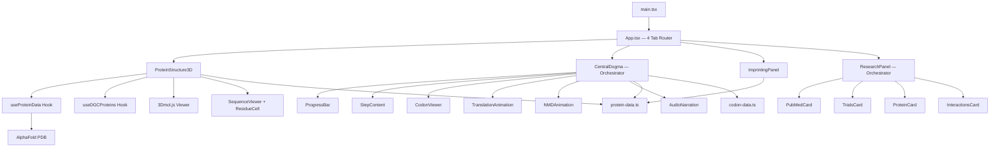

# SGCE &epsilon;-Sarcoglycan Explorer

[](https://vitejs.dev/)
[](https://react.dev/)
[](https://www.typescriptlang.org/)
[](https://3dmol.csb.pitt.edu/)
[]()
[](./LICENSE)

Interactive web visualization of the SGCE (epsilon-sarcoglycan) protein, built for understanding the molecular consequences of a **DYT-SGCE** mutation (**c.108dup**, p.Val37SerfsTer32).

This tool visualizes how a single-nucleotide duplication leads to complete loss of &epsilon;-sarcoglycan function through frameshift, nonsense-mediated decay, and genomic imprinting.

**Live:** [e-sarcoglycan.arcivus.ca](https://e-sarcoglycan.arcivus.ca)

---

## Features

### 3D Protein Structure
- Real **AlphaFold** predicted structure (AF-O43556-F1) rendered with **3Dmol.js**
- Domain coloring: extracellular (blue), transmembrane (amber), cytoplasmic (purple)
- Mutation site marker (Val37, red sphere) and N-glycosylation marker (Asn200, green)
- **Wild-type vs Mutant** toggle — full 437 aa structure vs truncated 68 aa fragment with STOP marker
- **DGC sarcoglycan subcomplex** overlay — &beta;/&gamma;/&delta;/&epsilon;-SG rendered together from AlphaFold structures
- Auto-rotate toggle and interactive zoom/rotation

### Sequence Viewer
- Linear amino acid track displaying all 437 residues with domain coloring
- Scrollable with mutation annotation overlay (frameshift at 37, PTC at 68, aberrant region 38-67)
- **Bidirectional 3D sync** — click residue in sequence &rarr; 3D viewer zooms to that position

### Central Dogma Animation
- **7-step animated walkthrough**: DNA &rarr; Imprinting &rarr; Transcription &rarr; Splicing &rarr; Translation &rarr; NMD &rarr; Result
- **Codon viewer**: WT/mutant reading frame comparison with frameshift and PTC markers (CDS from NM_003919.3)
- **Ribosome translation**: 80S ribosome scanning mRNA with peptide chain growth and frameshift visualization
- **NMD pathway**: 4-step animation (PTC recognition &rarr; UPF1 recruitment &rarr; phosphorylation &rarr; mRNA degradation)
- framer-motion spring animations with AnimatePresence transitions
- Adaptive autoplay with per-step durations
- Audio narration toggle (Web Speech API)

### Genomic Imprinting
- Visual explanation of maternal silencing via CpG methylation
- Paternal vs maternal allele comparison with chromatin marks
- Why this mutation causes **complete loss of function**, not haploinsufficiency

### Research Tab
- **PubMed**: Latest SGCE/DYT11 publications from NCBI E-utilities
- **ClinicalTrials.gov**: Active clinical trials for DYT-SGCE
- **UniProt**: Live protein annotations (O43556)
- **STRING DB**: Protein-protein interaction network for DGC complex

---

## Architecture



---

## Quick Start

```bash
# Install dependencies
npm install

# Download AlphaFold PDB structure
npm run fetch-pdb

# Start dev server
npm run dev
```

The app opens at [http://localhost:3000](http://localhost:3000).

---

## Development Commands

| Command | Description |
|---------|-------------|
| `npm install` | Install dependencies |
| `npm run fetch-pdb` | Download AlphaFold PDB (AF-O43556-F1-model_v6) |
| `npm run dev` | Start Vite dev server (port 3000) |
| `npm run build` | TypeScript check + production build |
| `npm run preview` | Preview production build |
| `npm run test` | Run all tests (Vitest) |
| `npm run test:watch` | Run tests in watch mode |
| `npm run test:coverage` | Run tests with coverage report |
| `npm run test:ui` | Open Vitest UI |

---

## Testing

337 tests across 37 test files using **Vitest** + **React Testing Library**.

Coverage includes:
- Component rendering and interaction (3D viewer, sequence viewer, central dogma, research cards)
- Hook behavior (usePubMed, useClinicalTrials, useUniProt, useStringDB, useDGCProteins)
- Codon data integrity (CDS sequence, frameshift math, PTC position)
- Animation sub-components (ProgressBar, TranslationAnimation, NMDAnimation)
- Utility functions (fetchCache, hexToInt, translatePdb, getDomainForPosition)
- Autoplay with adaptive durations (fake timers)
- Audio narration (Web Speech API mocks)

```bash
npm run test           # Single run
npm run test:watch     # Watch mode
npm run test:coverage  # With coverage
```

---

## Tech Stack

| Layer | Technology |
|-------|-----------|
| Build | Vite 6 |
| UI | React 18, TypeScript 5.6 |
| 3D Visualization | 3Dmol.js (AlphaFold PDB rendering) |
| Animation | Framer Motion 11 |
| Styling | Tailwind CSS 3.4 |
| State | Zustand 5 |
| Testing | Vitest 4, React Testing Library |
| Protein Data | AlphaFold DB (UniProt O43556) |

---

## Scientific Context

- **Gene**: SGCE (chr7q21.3, 13 exons)
- **Protein**: &epsilon;-Sarcoglycan — 437 aa, type I transmembrane glycoprotein
- **Mutation**: c.108dup &rarr; frameshift at Val37 &rarr; premature stop at position 68
- **Imprinting**: Maternal allele silenced &rarr; only paternal allele expressed
- **Consequence**: Paternal mutation + maternal silencing = **zero functional protein**
- **Disease**: DYT-SGCE (Myoclonus-Dystonia, DYT11)

All structural data from [UniProt O43556](https://www.uniprot.org/uniprot/O43556) and [AlphaFold](https://alphafold.ebi.ac.uk/entry/O43556).

---

## Roadmap

- [x] Real AlphaFold PDB structure with 3Dmol.js
- [x] Domain coloring + mutation/glycosylation markers
- [x] WT vs Mutant toggle
- [x] Linear sequence viewer with bidirectional 3D sync
- [x] Animated central dogma (ribosome translation, NMD pathway, codon viewer)
- [x] Audio narration (Web Speech API)
- [x] External data integration (PubMed, ClinicalTrials, UniProt, STRING)
- [x] DGC sarcoglycan subcomplex 3D overlay
- [ ] PWA support + export visualizations
- [ ] Favicon, a11y polish, meta description

---

## Deployment

Hosted on **Vercel** with **Cloudflare DNS**. Auto-deploys on push to main.

- **Live**: [e-sarcoglycan.arcivus.ca](https://e-sarcoglycan.arcivus.ca)
- **GitHub**: [cyanprot/sgce-explorer](https://github.com/cyanprot/sgce-explorer)

---

## License

[MIT](./LICENSE) &copy; 2026 Jongmin Lee
