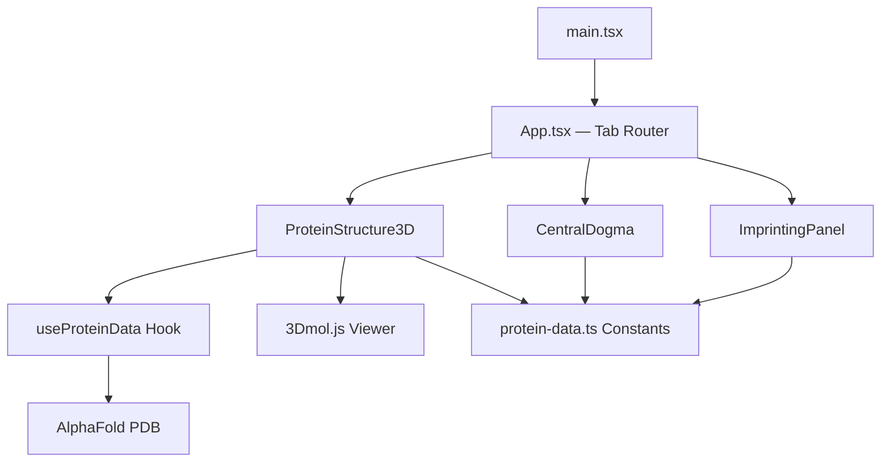

# SGCE ε-Sarcoglycan Explorer

[](https://vitejs.dev/)
[](https://react.dev/)
[](https://www.typescriptlang.org/)
[](https://3dmol.csb.pitt.edu/)
[](./LICENSE)

Interactive web visualization of the SGCE (epsilon-sarcoglycan) protein, built for understanding the molecular consequences of a **DYT-SGCE** mutation (**c.108dup**, p.Val37SerfsTer32).

This tool visualizes how a single-nucleotide duplication leads to complete loss of ε-sarcoglycan function through frameshift, nonsense-mediated decay, and genomic imprinting.

---

## Features

### 3D Protein Structure
- Real **AlphaFold** predicted structure (AF-O43556-F1) rendered with **3Dmol.js**
- Domain coloring: extracellular (blue), transmembrane (amber), cytoplasmic (purple)
- Mutation site marker (Val37) and N-glycosylation marker (Asn200)
- **Wild-type vs Mutant** toggle — full 437 aa structure vs truncated 68 aa fragment
- Interactive rotation, zoom, and auto-rotate

### Central Dogma Pathway
- 7-step walkthrough: DNA → Imprinting → Transcription → Splicing → Translation → NMD → Result
- Each step shows both normal biology and mutation-specific consequences

### Genomic Imprinting
- Visual explanation of maternal silencing via CpG methylation
- Paternal vs maternal allele comparison with chromatin marks
- Why this mutation causes **complete loss of function**, not haploinsufficiency

---

## Architecture



```
src/
├── App.tsx                     # Tab router + layout
├── components/
│   ├── ProteinStructure3D.tsx  # 3Dmol.js protein viewer
│   ├── CentralDogma.tsx        # 7-step central dogma
│   ├── ImprintingPanel.tsx     # Imprinting mechanism
│   └── ui/                     # Shared UI components
├── constants/
│   └── protein-data.ts         # Domains, mutation, sequences, colors
├── hooks/
│   └── useProteinData.ts       # AlphaFold PDB fetch with validation
└── types/
    └── index.ts                # Shared TypeScript interfaces
```

---

## Quick Start

```bash
# Install dependencies
npm install

# Download AlphaFold PDB structure
npm run fetch-pdb

# Start dev server
npm run dev
```

The app opens at [http://localhost:3000](http://localhost:3000).

---

## Development Commands

| Command | Description |
|---------|-------------|
| `npm install` | Install dependencies |
| `npm run fetch-pdb` | Download AlphaFold PDB (AF-O43556-F1-model_v6) |
| `npm run dev` | Start Vite dev server (port 3000) |
| `npm run build` | TypeScript check + production build |
| `npm run preview` | Preview production build |

---

## Tech Stack

| Layer | Technology |
|-------|-----------|
| Build | Vite 6 |
| UI | React 18, TypeScript 5.6 |
| 3D Visualization | 3Dmol.js (AlphaFold PDB rendering) |
| Animation | Framer Motion |
| Styling | Tailwind CSS 3.4 |
| Protein Data | AlphaFold DB (UniProt O43556) |

---

## Scientific Context

- **Gene**: SGCE (chr7q21.3, 13 exons)
- **Protein**: ε-Sarcoglycan — 437 aa, type I transmembrane glycoprotein
- **Mutation**: c.108dup → frameshift at Val37 → premature stop at position 68
- **Imprinting**: Maternal allele silenced → only paternal allele expressed
- **Consequence**: Paternal mutation + maternal silencing = **zero functional protein**
- **Disease**: DYT-SGCE (Myoclonus-Dystonia, DYT11)

All structural data from [UniProt O43556](https://www.uniprot.org/uniprot/O43556) and [AlphaFold](https://alphafold.ebi.ac.uk/entry/O43556).

---

## Roadmap

- [x] Real AlphaFold PDB structure with 3Dmol.js
- [x] Domain coloring + mutation/glycosylation markers
- [x] WT vs Mutant toggle
- [ ] Linear sequence viewer with linked 3D interaction
- [ ] Animated central dogma (ribosome translation, NMD pathway)
- [ ] External data integration (PubMed, ClinicalTrials, UniProt REST)
- [ ] Deployment (PWA)

---

## Deployment

Live at **[arcivus.northprot.com](https://arcivus.northprot.com)**

Served via Cloudflare Tunnel routing to `localhost:3000`.

---

## License

[MIT](./LICENSE)
